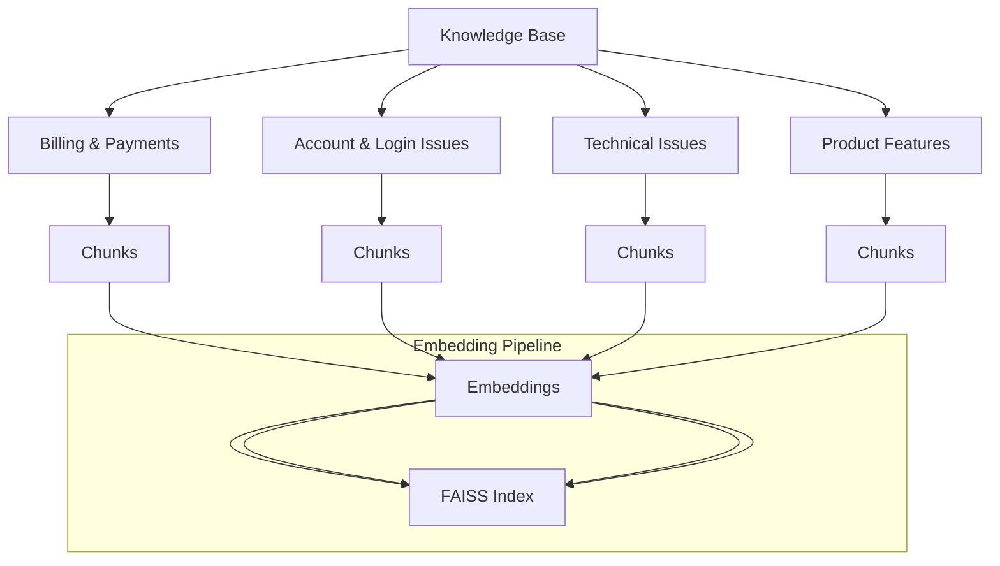

# 📞 **AI Customer Support Agent**

*Intelligent, automated customer support powered by LLMs, semantic retrieval, and Gradio.*

---

## 📌 **Overview**

The **AI Customer Support Agent** is an end-to-end intelligent support system designed to automate responses to customer queries using:

* **Google Gemini 1.5 models**
* **FAISS semantic vector search**
* **Agent-based modular pipeline**
* **Gradio web interface**

This project demonstrates how modern enterprise support systems can process user queries, classify intent, retrieve knowledge, generate accurate responses, evaluate correctness, and escalate critical issues — all automatically.

---

## 🚀 **Key Features**

✔ **Intent Classification** (billing, technical issue, account, general inquiry)
✔ **Semantic Retrieval** via **FAISS Vector Store**
✔ **Context-aware Response Generation** using Gemini 1.5
✔ **Quality Evaluation** of generated responses
✔ **Automated Escalation** for complex or low-confidence queries
✔ **Session Memory** for multi-turn conversation
✔ **Simple Gradio UI** for interaction
✔ **Modular, extensible architecture**

---

## 🧠 **System Architecture**

```mermaid
flowchart TD

%% ========== INPUT LAYER ==========
A[Input Layer\n(User Query via Gradio UI)] --> B[Preprocessing & Utilities]

%% ========== PREPROCESSING ==========
B --> C1[Text Cleaning]
B --> C2[Document Chunking]
B --> C3[Embedding Generation]

C1 --> D[FAISS Vector Store]
C2 --> D
C3 --> D

%% ========== FAISS STORE ==========
D --> H[Retrieval Agent]

%% ========== INTENT CLASSIFICATION ==========
A --> E[Intent Classification Agent]
E --> J[Orchestrator]

%% ========== RETRIEVAL AGENT ==========
H --> J

%% ========== RESPONSE GENERATOR ==========
J --> F[Response Generator\n(Gemini 1.5)]
F --> J

%% ========== EVALUATION AGENT ==========
J --> G[Evaluation Agent]
G --> J

%% ========== ESCALATION AGENT ==========
J --> I[Escalation Agent]
I --> J

%% ========== SESSION MEMORY ==========
J --> K[Session Memory]
K --> J

%% ========== FINAL OUTPUT ==========
J --> L[Final Output\n(Intent + Context + Response + Score + Escalation)]
L --> M[Displayed in Gradio UI]

```


---

## 🔧 **Technologies Used**

| Component           | Technology                        |
| ------------------- | --------------------------------- |
| LLM                 | **Google Gemini 1.5 Flash / Pro** |
| Semantic Search     | **FAISS**                         |
| Knowledge Retrieval | Vector embeddings                 |
| UI Framework        | **Gradio**                        |
| Language            | Python                            |
| Architecture Style  | Agent-based modular pipeline      |
| Runtime             | Google Colab / Local Machine      |

---

## 📂 **Project Structure**

```
project/
│── ai_customer_support_agent.py     # Main logic  
│── knowledge_base/                  # KB docs (optional)
│── assets/                          # Screenshots  
│── README.md                        # Documentation  
│── requirements.txt                 # Dependencies  
└── ...
```

---

## ⚙️ **Installation**

### **1. Clone the repository**

```bash
git clone https://github.com/your-username/ai-customer-support-agent.git
cd ai-customer-support-agent
```

### **2. Install dependencies**

```bash
pip install -r requirements.txt
```

### **3. Set your Gemini API Key**

```python
import os
os.environ["GOOGLE_API_KEY"] = "YOUR_API_KEY"
```

### **4. Run the App**

```bash
python ai_customer_support_agent.py
```

---

## 🧪 **Usage (Gradio Interface)**

Once the app starts, you can:

1. Enter any customer-related query (e.g., *"I forgot my password"*)
2. View:

   * Detected **intent**
   * Retrieved **knowledge base chunks**
   * **Generated response**
   * **Evaluation score**
   * Whether **escalation** is required
3. Explore multiple queries in a session — context is preserved.

---

## 🗂️ **Knowledge Base Structure**



---


## 📈 **Future Enhancements**

* 🌐 Multilingual support
* 🎙️ Voice-based customer support
* 🤖 Auto-training from conversation logs
* 🔍 Advanced analytics dashboard
* 🧩 Integrations with CRM / ticketing systems

---

## 🤝 **Contributing**

Contributions are welcome!
You can:

* Submit a Pull Request
* Open an Issue
* Improve documentation

---

## 📜 **License**

This project is released under the **MIT License**.

---

## ⭐ **Support the Project**

If this project helped you, feel free to star ⭐ the repository!

---

